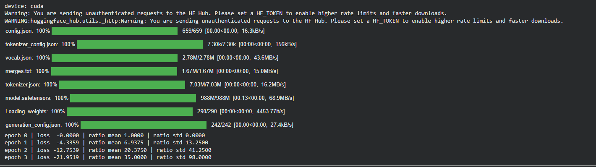
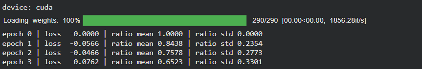
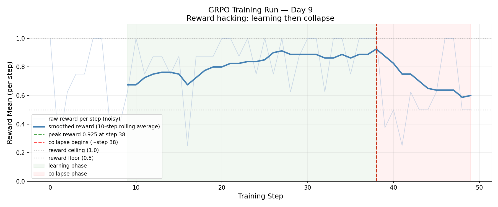
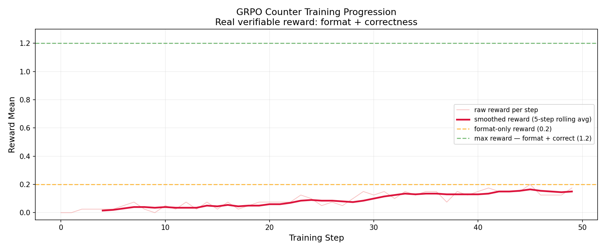
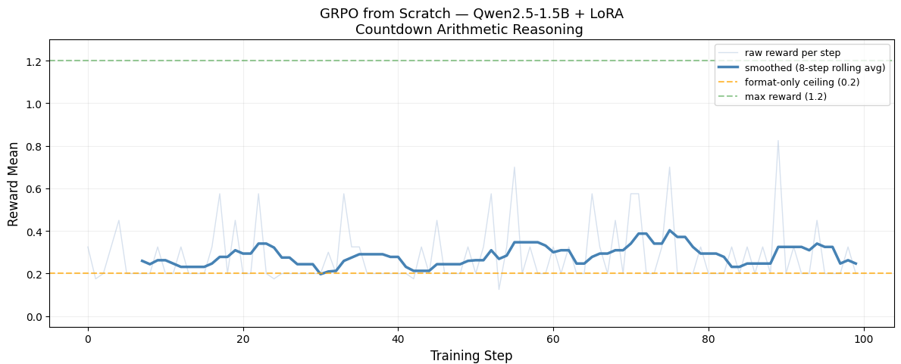

# GRPO from Scratch

Building **Group Relative Policy Optimization** (the RL algorithm behind DeepSeek-R1) from first principles in plain PyTorch — no TRL, no verl, just `transformers` + a training loop I wrote myself.

The lineage in one line:

> **REINFORCE** (raw return → high variance) → **subtract a baseline** (advantage → lower variance) → **PPO** (critic estimates the baseline + clip the update for stability) → **GRPO** (throw out the critic, get the baseline from a *group's* mean/std, keep clipping, add a KL leash).

Full derivations and study notes are in [NOTES.md](NOTES.md).

## The progression

Each script is one self-contained experiment that adds exactly one idea on top of the previous one. Models: Qwen2.5-0.5B-Instruct (steps 1–9), Qwen2.5-1.5B-Instruct + LoRA (steps 10–11).

| # | Script | What it adds | What I learned |
|---|--------|--------------|----------------|
| 01 | [`01_reinforce.py`](01_reinforce.py) | Vanilla policy gradient: `loss = -(reward · seq_logp)` | Push up log-probs of rewarded completions. Works, but noisy. |
| 02 | [`02_reinforce_baseline.py`](02_reinforce_baseline.py) | Subtract the group mean as a baseline; track gradient norms | The baseline reduces gradient variance without biasing the update. |
| 03 | [`03_ppo_ratio_unclipped.py`](03_ppo_ratio_unclipped.py) | Old-policy snapshot + importance ratio, multiple epochs per rollout | Without a constraint the ratio explodes (1.0 → 35 in 3 epochs). This is *why* PPO clips. |
| 04 | [`04_ppo_clipped.py`](04_ppo_clipped.py) | The clipped surrogate objective | Clipping alone isn't enough — clip range and learning rate are coupled (lr=1e-5 still blew up; 1e-6 was stable). |
| 05 | [`05_grpo_kl_reference.py`](05_grpo_kl_reference.py) | Frozen reference model + k3 KL estimator | The clip ratio (vs. rollout snapshot) and the KL (vs. original checkpoint) are two *different* comparisons. |
| 06 | [`06_grpo_full_loss.py`](06_grpo_full_loss.py) | Group-relative advantage `(r − mean)/std` → complete GRPO loss | The group mean replaces PPO's critic. Uniform rewards → zero advantage → no signal. |
| 07 | [`07_grpo_reward_hacking.py`](07_grpo_reward_hacking.py) | Multi-prompt training with a length-based reward | Reward climbed 0.63 → 0.99, then collapsed — classic reward hacking. Length rewards are trivially gamed. |
| 08 | [`08_grpo_modular.py`](08_grpo_modular.py) | Clean `rollout()` / `compute_advantages()` / `update()` structure, uniform-reward skip guard | ~70% of steps got skipped: the length reward saturates. Motivates a verifiable reward. |
| 09 | [`09_grpo_countdown.py`](09_grpo_countdown.py) | Countdown arithmetic task with a verifiable reward (0.2 format + 1.0 correctness) | Two-component reward gives signal even before the model can solve the task — it learns format first, then correctness. |
| 10 | [`10_grpo_lora.py`](10_grpo_lora.py) | Scale to Qwen2.5-1.5B with LoRA (r=16, q/v projections) | LoRA makes RL on a bigger model fit in memory; only adapter params get optimized. |
| 11 | [`11_grpo_final.py`](11_grpo_final.py) | Final run: bf16, tuned reward parsing, easier problem distribution, β=0.15 | The complete pipeline end to end. |

## Results

**PPO ratio explosion without clipping (03)** — multiple epochs on one rollout batch, no constraint:



**With clipping + sane lr (04)** — stable ratio drift instead:



**Reward hacking on a length reward (07)** — genuine learning, then policy collapse once the policy drifts too far from the reference:



**Countdown task with verifiable reward (09)** — 0.5B model, reward trends up from zero as format is learned:



**Final run (11)** — Qwen2.5-1.5B + LoRA on countdown arithmetic:



More screenshots from individual runs are in [`images/`](images).

## Running

```bash
pip install -r requirements.txt
python 11_grpo_final.py   # or any numbered script
```

Each script is standalone. A CUDA GPU is strongly recommended (scripts 10–11 load a 1.5B model twice — policy + frozen reference).

## Key GRPO facts (the 4 checks)

1. **Why no value network?** The group mean replaces it as the baseline.
2. **Advantage of one completion?** `(reward_i − group_mean) / group_std`.
3. **What do clipping and KL each prevent?** Clipping: too-large policy steps. KL: drifting too far from the reference model.
4. **The LLM setting is a bandit.** One completion → one terminal reward, broadcast to every token. No γ, no Q/V, no return-to-go.
